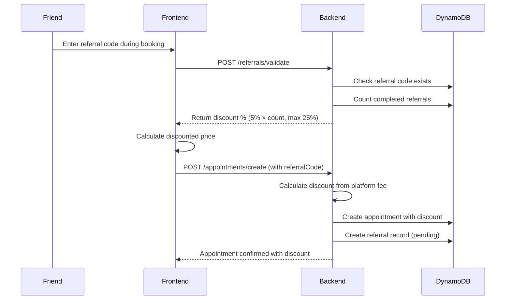
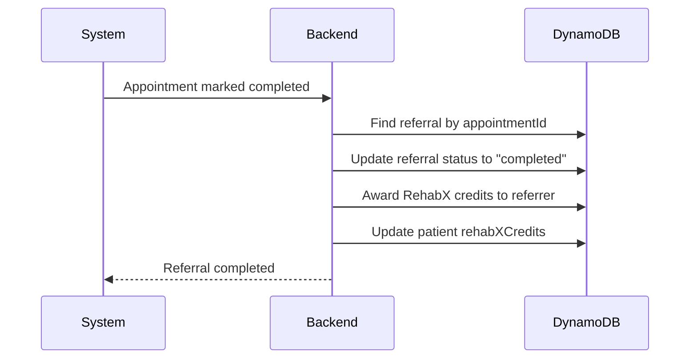

# 🎁 Referral System Documentation

## Business Logic

### Commission Structure

- **Platform Fee**: 10% of appointment cost
- **Referral Discount**: 5% per referral (given to the friend booking)
- **Maximum Discount**: 25% (5 referrals)
- **RehabX Credits**: Awarded to referrer when friend completes appointment

### Example Calculation

**Scenario**: Appointment costs $100, friend uses referral code with 2 successful referrals

```
Original Appointment Cost: $100
Platform Fee (10%): $10

Referral Discount Calculation:
- 2 referrals × 5% each = 10% discount
- Discount amount: $100 × 10% = $10
- Discount comes from platform fee: $10 (available) ≥ $10 (needed) ✅

Final Cost to Friend: $100 - $10 = $90
Platform Net Revenue: $10 - $10 = $0
Therapist Receives: $90
RehabX Credits to Referrer: 200 credits (100 per completed referral)
```

**Max Discount Scenario**: 5 successful referrals

```
Original Appointment Cost: $100
Platform Fee (10%): $10

Referral Discount Calculation:
- 5 referrals × 5% each = 25% discount
- Discount amount: $100 × 25% = $25
- Discount comes from platform fee: $10 (available) < $25 (needed)
- Actual discount applied: $10 (capped by platform fee)

Final Cost to Friend: $100 - $10 = $90
Platform Net Revenue: $10 - $10 = $0
Therapist Receives: $90
RehabX Credits to Referrer: 500 credits (100 per completed referral)
```

## Database Schema

### Table: `itselfcare_referrals`

```python
{
    "referralId": "ref_1234567890",           # Primary Key (String)
    "referrerPatientId": "patient_abc123",     # Who shared the code
    "referredPatientId": "patient_xyz789",     # Who used the code
    "referralCode": "ITSCARE2025",             # Unique referral code
    "status": "pending",                       # pending | completed | expired
    "discountPercentage": 5,                   # Discount for this referral (5% per)
    "rehabXCredits": 100,                      # Credits awarded when completed
    "appointmentId": "appt_123",               # Related appointment (when booked)
    "createdAt": "2025-11-23T10:00:00Z",
    "completedAt": "2025-11-23T11:30:00Z",     # When appointment completed
    "expiresAt": "2026-11-23T10:00:00Z"        # Referral expiration (1 year)
}
```

### Indexes

**GSI1**: `referrerPatientId-status-index`

- Partition Key: `referrerPatientId`
- Sort Key: `status`
- Use case: Get all referrals by a patient

**GSI2**: `referralCode-index`

- Partition Key: `referralCode`
- Use case: Validate referral code uniqueness

## API Endpoints

### 1. Generate Referral Code

```
POST /referrals/generate
Body: {
    "patientId": "patient_abc123"
}
Response: {
    "referralCode": "ITSCARE2025",
    "expiresAt": "2026-11-23T10:00:00Z"
}
```

### 2. Validate Referral Code

```
POST /referrals/validate
Body: {
    "referralCode": "ITSCARE2025",
    "patientId": "patient_xyz789"  # Who is using the code
}
Response: {
    "valid": true,
    "referrerPatientId": "patient_abc123",
    "referrerName": "John Doe",
    "completedReferrals": 2,       # How many referrals they've completed
    "discountPercentage": 10,      # 2 × 5% = 10%
    "maxDiscount": 25
}
```

### 3. Apply Referral to Booking

```
POST /referrals/apply
Body: {
    "referralCode": "ITSCARE2025",
    "referredPatientId": "patient_xyz789",
    "appointmentId": "appt_123",
    "appointmentCost": 100
}
Response: {
    "referralId": "ref_1234567890",
    "discountAmount": 10,
    "finalCost": 90,
    "creditsAwarded": 100
}
```

### 4. Get Patient Referrals

```
GET /referrals/patient/{patientId}
Response: {
    "referralCode": "ITSCARE2025",
    "totalReferrals": 5,
    "completedReferrals": 2,
    "pendingReferrals": 3,
    "totalCreditsEarned": 200,
    "totalDiscountsGiven": 20,
    "referrals": [
        {
            "referralId": "ref_123",
            "referredPatientName": "Jane Smith",
            "status": "completed",
            "appointmentDate": "2025-11-20",
            "creditsEarned": 100,
            "discountGiven": 10
        }
    ]
}
```

### 5. Complete Referral (Called after appointment)

```
POST /referrals/{referralId}/complete
Body: {
    "appointmentId": "appt_123"
}
Response: {
    "referralId": "ref_123",
    "status": "completed",
    "creditsAwarded": 100,
    "referrerPatientId": "patient_abc123"
}
```

## Integration Flow

### Booking with Referral Code



### Completing Referral



## Discount Calculation Logic

```python
def calculate_referral_discount(referral_code: str, appointment_cost: float) -> dict:
    # 1. Get completed referrals count
    completed_count = get_completed_referrals_count(referral_code)

    # 2. Calculate discount percentage (5% per referral, max 25%)
    discount_percentage = min(completed_count * 5, 25)

    # 3. Calculate discount amount
    discount_amount = appointment_cost * (discount_percentage / 100)

    # 4. Calculate platform fee (10%)
    platform_fee = appointment_cost * 0.10

    # 5. Cap discount at platform fee (can't go negative)
    actual_discount = min(discount_amount, platform_fee)

    # 6. Calculate final cost
    final_cost = appointment_cost - actual_discount

    return {
        "discountPercentage": discount_percentage,
        "discountAmount": actual_discount,
        "finalCost": final_cost,
        "platformFee": platform_fee,
        "netRevenue": platform_fee - actual_discount
    }
```

## RehabX Credits

### Credit Award System

- **Per Completed Referral**: 100 credits
- **Awarded When**: Friend completes their first appointment
- **Stored In**: `itselfcare_patients.rehabXCredits` field

### Credit Usage

Credits can be used in RehabX 3D platform for:

- Premium exercise library access
- Custom workout plans
- Advanced analytics
- Virtual PT sessions

## Frontend Integration

### PatientReferrals Page

```typescript
// Load real data from API
const { data: referralData } = await referralAPI.getByPatient(patientId);

// Display stats
- Total Referrals: referralData.totalReferrals
- Completed: referralData.completedReferrals
- RehabX Credits Earned: referralData.totalCreditsEarned
- Total Savings Given: $referralData.totalDiscountsGiven
```

### Booking Dialog (FindTherapist)

```typescript
// Add referral code input
<Input
  placeholder="Enter referral code (optional)"
  value={referralCode}
  onChange={(e) => setReferralCode(e.target.value)}
/>;

// Validate and show discount
if (referralCode) {
  const validation = await referralAPI.validate(referralCode, patientId);
  if (validation.valid) {
    setDiscount(validation.discountPercentage);
    setFinalCost(appointmentCost * (1 - validation.discountPercentage / 100));
  }
}
```

## Table Creation Script

```bash
# Add to create_tables.sh

# Create referrals table
aws dynamodb create-table \
    --table-name itselfcare_referrals \
    --attribute-definitions \
        AttributeName=referralId,AttributeType=S \
        AttributeName=referrerPatientId,AttributeType=S \
        AttributeName=status,AttributeType=S \
        AttributeName=referralCode,AttributeType=S \
    --key-schema \
        AttributeName=referralId,KeyType=HASH \
    --billing-mode PAY_PER_REQUEST \
    --global-secondary-indexes \
        "[
            {
                \"IndexName\": \"referrerPatientId-status-index\",
                \"KeySchema\": [
                    {\"AttributeName\":\"referrerPatientId\",\"KeyType\":\"HASH\"},
                    {\"AttributeName\":\"status\",\"KeyType\":\"RANGE\"}
                ],
                \"Projection\": {\"ProjectionType\":\"ALL\"},
                \"ProvisionedThroughput\": {
                    \"ReadCapacityUnits\": 5,
                    \"WriteCapacityUnits\": 5
                }
            },
            {
                \"IndexName\": \"referralCode-index\",
                \"KeySchema\": [
                    {\"AttributeName\":\"referralCode\",\"KeyType\":\"HASH\"}
                ],
                \"Projection\": {\"ProjectionType\":\"ALL\"},
                \"ProvisionedThroughput\": {
                    \"ReadCapacityUnits\": 5,
                    \"WriteCapacityUnits\": 5
                }
            }
        ]" \
    --region eu-north-1
```

## Testing Scenarios

### Test Case 1: First Referral

```
1. Patient A generates referral code: ITSCARE2025
2. Patient B uses code to book $100 appointment
3. Completed referrals for Patient A: 0
4. Discount: 0 × 5% = 0%
5. Patient B pays: $100 (no discount for first referral)
6. Appointment completes
7. Patient A earns: 100 RehabX credits
8. Referral status: completed
```

### Test Case 2: Second Referral

```
1. Patient C uses ITSCARE2025 to book $100 appointment
2. Completed referrals for Patient A: 1 (Patient B completed)
3. Discount: 1 × 5% = 5%
4. Patient C pays: $95 ($5 discount)
5. Appointment completes
6. Patient A earns: 100 RehabX credits (total: 200)
7. Referral status: completed
```

### Test Case 3: Maximum Discount

```
1. Patient F uses ITSCARE2025 to book $100 appointment
2. Completed referrals for Patient A: 5
3. Discount: 5 × 5% = 25%
4. Discount amount: $25, but platform fee only $10
5. Actual discount: $10 (capped at platform fee)
6. Patient F pays: $90
7. Patient A earns: 100 RehabX credits (total: 600)
```

## Migration Notes

### Update Patient Schema

Add new field to `itselfcare_patients`:

```python
{
    "patientId": "patient_123",
    "name": "John Doe",
    # ... existing fields ...
    "rehabXCredits": 0,           # NEW: RehabX credits earned
    "referralCode": "ITSCARE2025" # NEW: Unique referral code
}
```

### Update Appointment Schema

Add referral tracking:

```python
{
    "appointmentId": "appt_123",
    # ... existing fields ...
    "referralCode": "ITSCARE2025",     # NEW: Code used (if any)
    "discountApplied": 10,             # NEW: Discount amount
    "originalCost": 100,               # NEW: Before discount
    "finalCost": 90                    # NEW: After discount
}
```

## Status

- ✅ Business logic defined
- ✅ Database schema designed
- ✅ API endpoints documented
- ⏳ Backend implementation pending
- ⏳ Frontend integration pending
- ⏳ Table creation pending
